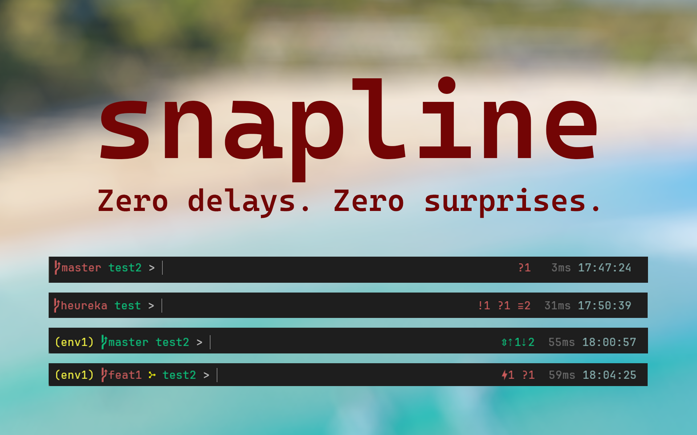

# snapline
Prompt theme for Windows+cmd+Clink focusing on speed and concise info using caching and async techniques to ensure snappiness at all times.

* ## Speed
  * Use only sub-millisecond calls to render the prompt.
  * Async all delays so editing is never blocked.
  * Cache last results so info is always present.
* ## Info
  * virtual environment
  * git branch
  * git in-progress action
  * currwnt working directory
    * no-repo in white
    * clean in green
    * dirty in red (untracked files found(
  * git status
  * clock of last executed command
  * current time
* ## git
  * branch
    * clean in green
    * dirty in red
    * no-repo in white
  * in-progress action glyph in yellow for
    * interactive rebase
    * rebase merge
    * rebase
    * mail split
    * mail split rebase
    * merging
    * cherry-picking
    * reverting
    * bisecting
  * status
    * conflicted |N
    * ahead      ⇡N
    * behind     ⇣N
    * diverged   ⇕⇡A⇣B'
    * tracked    ?
    * stashed    ≡N
    * modified   !N
    * staged     +N
    * renamed    »N
    * deleted    XN
    * untracked  ??
