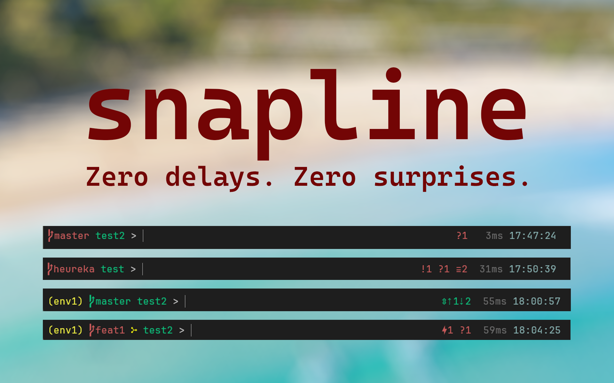
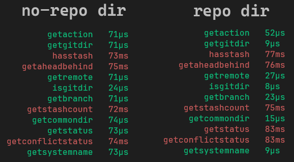
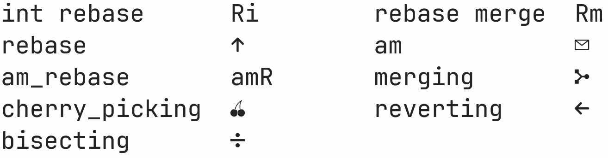
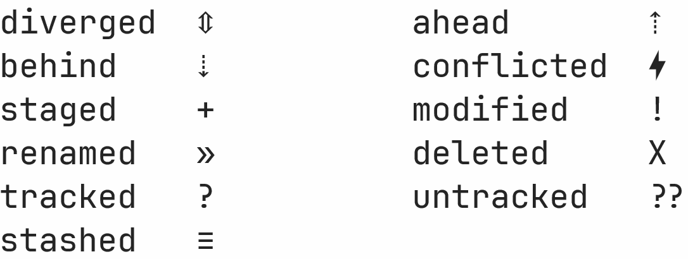
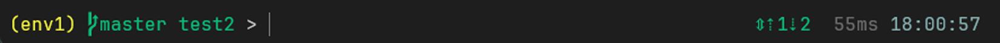
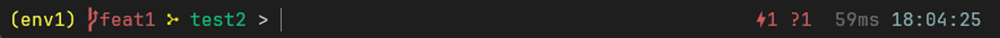

Prompt theme for Windows+cmd+[Clink](https://github.com/chrisant996/clink) rendering Git status while focusing on speed and concise info using caching and async techniques to ensure snappiness at all times.

## Speed
  * Using only sub-millisecond calls to build the prompt - git only ever runs async.
  * Async all delays so editing is never blocked.
  * Cache last results so the content is always & instantly present.
  * Implement alternative methods proven to run much faster.
  * Blank Enter reuses the last git status - no git process is spawned at all.
  * Status-neutral commands (```cls```, ```dir```, ```type```, ```git log```, ```git diff```, ... with no redirection) also reuse the last status - most prompts spawn nothing.
  * ```cd``` within the same repo carries the status over - git status is repo-wide, so no blank flash and no extra git run.
  * Async status survives Enter: on a slow repo the refresh lands on a later prompt instead of being canceled and restarted by every command.
  * Idle repo watcher notices commits made from other terminals/editors (µs-scale content fingerprints, including reftable repositories) and refreshes the prompt by itself - no Enter needed.
  * Async status runs with ```--no-optional-locks``` so it never takes ```index.lock``` and never collides with git commands typed at the prompt.
  * Stash count is collected by the existing async porcelain status process; no synchronous stash probe or extra process is needed.
  * One-time hint to enable ```core.fsmonitor``` when git status is repeatedly slow.
  * Benchmark of Clink methods, and alternative implementations; red are only called async.
    Type ```snapline-bench``` at the prompt to re-measure on your machine.
    
## Info
### Left prompt
  * virtual environment in yellow
  * git branch
  * git in-progress action; rebase and mail-apply actions include step/total progress when available, e.g. ```Ri3/12```
  * current working directory
    * no-repo in white
    * clean in green
    * dirty in red (untracked files found)
  * last exit code in red when nonzero, e.g. ```✗1 >``` (negative codes shown as hex NTSTATUS, e.g. ```✗0xC0000005 >```)
### Right prompt
  * git status glyphs (dimmed while an async refresh is still pending, dim ```…``` while the first status for a repo is collected)
  * ```⇡?``` when an upstream is configured but ahead/behind is unknown (upstream gone, or ```ahead_behind=false```)
  * git upstream, abbreviated to the remote name when it matches the current branch
  * dim ```~3d``` when the last fetch is older than 3 days (configurable) - ahead/behind may be outdated
  * duration of the last executed command (shown when ≥ 100ms, configurable)
  * current time
## git
  * branch
    * clean in green
    * dirty in red
    * no-repo in white
  * in-progress action legend
    <p align="center"></p>
  * status legend
    <p align="center"></p>
  * type ```snapline-legend``` at the prompt to print both legends with your configured glyphs

## Examples

* on dirty branch 'heureka', dir is clean, 1 file modified, 1 new file, 2 stash items


* active virtual environment 'env1', branch and dir are clean, branch is 1 commit ahead and 2 behind the origin


* virtual env 'env1', branch 'feat1' in dirty state, merge action in progress, dir is clean, 1 conflicted file, 1 new file


## Transient prompt

Past prompts can collapse to just the exit marker (```> ``` or ```✗1 > ```) with the submit time on the right, keeping scrollback compact. Opt in with:

    clink set prompt.transient always


## Configuration

All knobs live in the ```config``` table at the top of ```snapline.lua``` (reuse window, untracked scan interval, repo watcher, ahead/behind counts, fetch age, duration threshold, colors, glyphs, ...). A wrapper script loaded before snapline can also define a global ```snapline_config``` table to override entries without editing the file. Partial ```color```, ```status_format```, and ```action_symbol``` tables are merged with their defaults. Invalid or unknown options are ignored with a one-time message.

## Installation

Copy the ```.lua``` file into Clink configuration folder. Ensure terminal uses Nerd Fonts. Requires Clink 1.7.0 or newer (the script silently no-ops on older versions). When another ```.clinkprompt``` is selected, Snapline automatically stands down instead of mixing two prompts.

## Tests

Run the integration-style harness with Clink's Lua runtime:

    clink lua test\harness.lua
