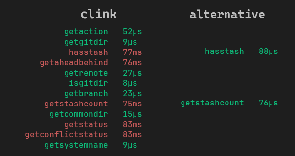

Prompt theme for Windows+cmd+[Clink](https://github.com/chrisant996/clink) focusing on speed and concise info using caching and async techniques to ensure snappiness at all times.

## Speed
  * Using only sub-millisecond calls to build the prompt.
  * Async all delays so editing is never blocked.
  * Cache last results so the content is always & instantly present.
  * Typical benchmark of Clink git calls
    <p align="center"></p>
## Info
### Left prompt
  * virtual environment in yellow
  * git branch
  * git in-progress action
  * current working directory
    * no-repo in white
    * clean in green
    * dirty in red (untracked files found)
### Right prompt
  * git status glyphs
  * duration of the last executed command
  * current time
## git
  * branch
    * clean in green
    * dirty in red
    * no-repo in white
  * in-progress action legend
    <p align="center"></p>
  * status legend
    <p align="center"></p>

## Examples

* on dirty branch 'heureka', dir is clean, 1 file modified, 1 new file, 2 stash items


* active virtual environment 'env1', branch and dir are clean, branch is 1 commit ahead and 2 behind the origin


* virtual env 'env1', branch 'feat1' in dirty state, merge action in progress, dir is clean, 1 conflicted file, 1 new file


## Installation

Copy the ```.lua``` file into Clink configuration folder. Ensure terminal uses Nerd Fonts.
